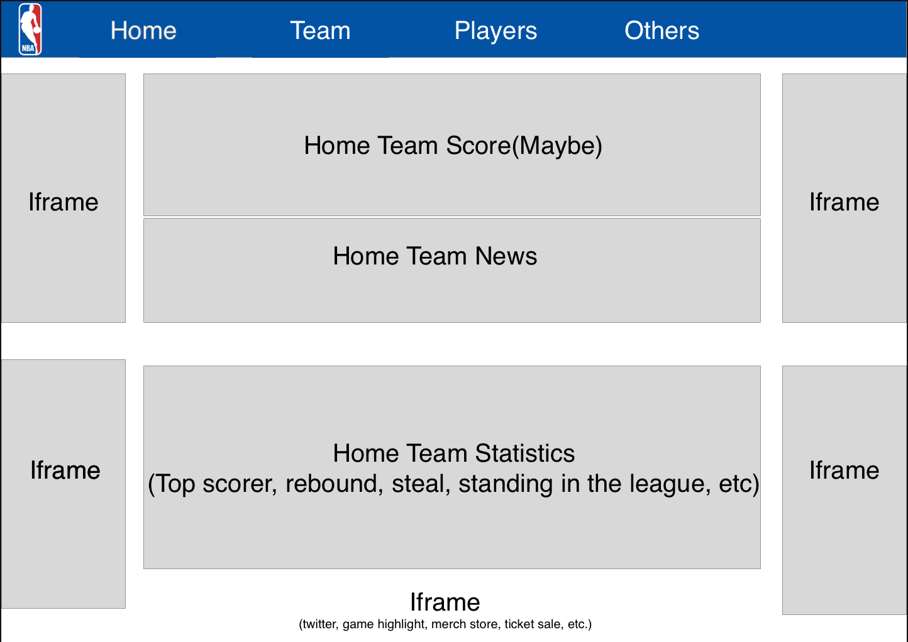
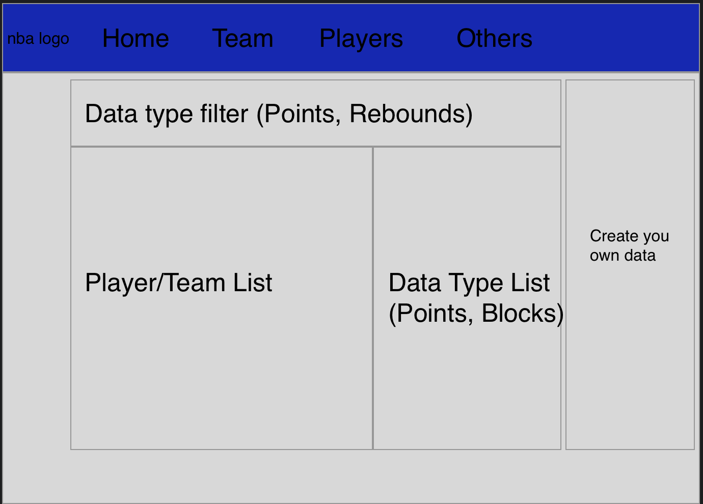
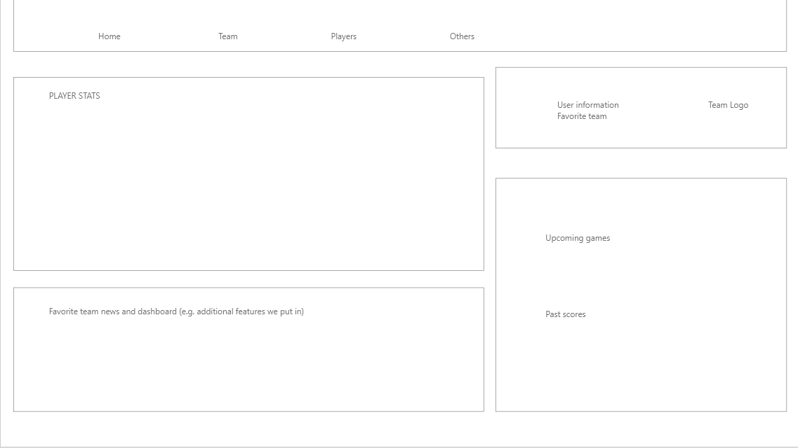

# NBA-Connect

# Basketball Statistics Database

<h6> Privacy Policy </h6>
We will only store your Email, hashed password, and name/profile image URL if you are logging in via Facebook. This information will not be shared with, or viewed by anyone not on the GGPanda team or the user themselves.

<h4> High level succinct description </h4>
Our website is a display of NBA Stats in conjunction with News articles and Match information as an information hub for users. Our primary goal is to allow the user to personalize their own NBA viewing experience.

<h4> Description </h4>
Our website will be a Basketball statistics database, with options for the user to select a favorite set of teams to focus on. It will contain live match data, past match statistics, and player statistics as needed by the user, who is most likely an avid follower of the NBA. With the data stored (player data, team data, user data), it will generate all kinds of analytics (such as shooting%, head-to-head results), all of which are tailored based on the user's needs. If time is allowed, there may be additional functionalities created involving the user, such as heatmaps for the user's favorite players, and a player fantasy game/system revolving past seasons' results.
<h4> Task Requirements </h4>
<h5> Minimal Requirements </h5>
<ul>
  <li>
    Create Website: Main Page, Stats Page, Login Page as per prototype
    <h6> Breakdown </h6>
    <ul>
      <li> Main page: user's favorite teams, upcoming matches, other cool information </li>
      <li> Stats page: player and team stats (e.g. win-loss record, shooting percentage, points)  </li>
      <li> Login page: allow user to create username + password, which allows them to log in with the stored information </li>
      <li> Design and write CSS for all required pages (no JS for now) </li>
    </ul>
  </li>
   
  <li>
    Write Website JavaScript
    <h6> Breakdown </h6>
    <ul>
      <li> Landing/main page: API calls to retrieve basic information </li>
      <li> Stats page: more API calls, find ways to efficiently store/retrieve information to prevent unnecessary API calls </li>
      <li> Login page: write JavaScript that stores the user's credentials (with hashed password) into MongoDB (to come next) </li>
      <li> Create animations as needed, and more fluid switching between tabs </li>
    </ul>
  </li>
   
  <li>
    Create Website MongoDB
    <h6> Breakdown </h6>
    <ul>
      <li> Create a MongoDB Atlas account (or another platform), and set up collections (e.g. matches, players, teams) </li>
      <li> Store static information from API calls for past seasons (to prevent extra calls) </li>
      <li> Store user credentials, and their favorite team </li>
      <li> Apply MongoDB connection strings to JavaScript </li>
    </ul>
  </li>
   
  <li> Create Necessary Assets for Website (images and etc) </li>
   
  <li> Allow users to view all teams and players, providing visualization for very basic statistics (points, shooting percentage) </li>
</ul>
<h5> Standard Requirements </h5>
<ul>
  <li> Graphing requested data, performing percentage calculations and other types of analysis </li>
  <li> Provide live match scores to live games. </li>
  <li> Allow the user to log in without Username/Password, such as using Facebook OAuth (will look further into it) </li>
  <li> Allow a message board on previous and live games, on which users may interact and chat about the games. </li>
  <li> On future match pages, provide statistics such as player's past stats over the past few games, and the win streaks of each team. </li>
  <li> Statistic comparisons between players and teams, for users looking to see how two teams match up. </li>
  <li> Creating a data filter for stats (e.g. order by points per game, order by games played) </li>
</ul>
<h5> Stretch Requirements </h5>
<ul>
  <li> Tailor homepage to user's favorite team (e.g. player twitter, logo, customized background) </li>
  <li> Implement useful iframes such as ticket sales </li>
  <li> Draw heatmaps for players based on player performance and court activity. </li>
  <li> Implement a fantasy draft system for users to play around with statistics from previous seasons. </li>
</ul>
<h4> Documentation </h4>
<strong>Basic Technology Requirements:<strong>
  <ul>
    <li>HTML/Styling
      <ul>
        <li>We styled our app using Bulma.io. With Bulma we all the css were written for us already and we can simply change the class name according to their documentation to have the desired visual effect. An example is we used a bulma template to style our login page, the code can be found <a href="https://github.com/Tonychen0227/CPSC436/blob/master/imports/ui/LogIn/LogIn.jsx">here</a></li>
      </ul>
    </li>
    <li>Redux</li>
      <ul>We store primarily the user state in the Redux store, which powers most of our website (twitter feed, discussion board etc...) We also use redux thunk to make calls to our back-end API, the information from which is stored in our Redux store (such as team stats, player stats, etc) </ul>
    <li>API</li>
      <ul>We use an API to gather player and team stats, as well as handle all user login features. You will find our API in a separate repo: https://github.com/Tonychen0227/CPSC436api</ul>
    <li>MongoDB</li>
      <ul>We have 4 collection in our mongoDB: user, team, player, and discussion. All self explanatory: the first saves user email, hashed password, JWT token, base64 profile picture, and other information, the second saves all team stats, the third saves all player stats, and the fourth saves all discussion board material. </ul>
    <li>Deployment</li>
      <ul>We deployed our app on Heroku with the Papertrail add-on to aid debugging. Same applies to our API project found here: cpsc436basketballapi.herokuapp.com. Our main app is found here: cpsc436basketball.herokuapp.com </ul>
  </ul>

<strong> Basic Contribution Requirements </strong>

<h5> Tony </h5>

I took charge of building an API for our project found here: https://github.com/Tonychen0227/CPSC436api
The primary technologies I took charge in were Meteor (most of the setup and adding required middleware) and MongoDB, where I built most of our database operations such as user login/logout as well as discussion.

<h5> Yuting </h5>

Implemented Stats/Plays, Stats/Teams and Stats/Analysis using Recharts and BizCharts for data visualization
Used axio to make call to our backend to retrieve teams and players data
Implemented several data filter for users to select and filter data under Stats page

<h5> Peter </h5>

Styled the app using Bulma.io. Implemented the Navbar and dropdown list for stats page.
Implemented the news carousel component and integrated NBA twitter App and team twitter App into our website.
Implemented backend calls to retrieve players and teams statistics from our database.

<strong> Functionality </strong>

This project solves the problem of the lack of a overall hub for NBA fans that includes news, discussion, and stat analysis not found on the official stats nba website. To solve this problem, we added the following integrations all into one web application: Stats analysis and comparisons (which is actually not possible on the official NBA stats page), Discussion board which is user customizable, The ability to select a favorite team and have the UX be affected based on what team is selected, official twitter accounts, and news.

<strong> Challenges </strong>
<ul>
  <li>User Login was faced with several challenges. Facebook SDK is hard to work with, and there were some weird requirements there such as the need for a privacy policy. Halfway through implementation we kind of got screwed over due to Facebook SDK deprecating http support, so we had to migrate. Also a lot of user testing was required with that aspect, and there were some challenges faced there. I think our user login reached a good spot and none of the problems were impossible to deal with, given enough effort was spent to resolve them.</li>
  <li>Styling was one of our challenges. We were focusing to much on implementing the functionality of our app; when we have made the      skeleton of our web it was too hard for us to write the css file due to the complexity and the number of components in our app. We tried writing css with Sketch and Zeplin using drawn structure but different components wouldn't work well with each others. We have to adapt another method to do the styling. We found Bulma.io. It took us around 2 days to read through and understand the documentation and it was fairly easy to use. This tool has greatly decreased our development time. In order to solve styling conflict and difference in opinion. We decided to have one developer styling the entire app</li>
</ul>

<strong> Above and beyond? </strong>
<ul>
  <li>Built the discussion board from scratch, using JWT token for login persistance, requiring email authentication, and allowing a user to log in via Facebook I think were all aspects that go above and beyond the basic requirements of a typical user login system. Additionally added profile picture support, which I think very few other teams were able to implement. </li>
  <li>We added media integration in our app. Our initial blueprint for the app is to be a statistic focused app where the sole purpose is for NBA stats enthusiasts to find and play with the data they want. Then we decided we want to make our app as an information hub for NBA fans. We have found API that provided news from ESPN and successfully retrieved the data using HTTP request and stored the news articles in redux state. We also integrated twitter into our app. We decided to map each twitter integration to each user given their favorite team. These features really took the advantage of redux state and made our app more tailored to user's preferences</li>
  <li>On the stats page, we implemented team and player comparisons: something that is unavailable on the official NBA stats website. This is one of our main standout features of our application. </li>
</ul>
<h4> Prototypes </h4>
<h6> Home Page </h6>

<h6> Stats Page </h6>

<h6> Account Page </h6>

<h6> Team Members: Peter Han, Yuting Wen, Tony Chen </h6>
